# 📚 Bookworm – Full-Stack E-Commerce Application


## 📖 About the Project

**Bookworm** is a modern **full-stack e-commerce application** built with **ASP.NET Core Web API** and **React.js (TypeScript)**.The project is designed with real-world e-commerce scenarios in mind, focusing on **scalability**, **security**, and **maintainability**.

The frontend and backend are developed as fully decoupled applications.
---

## 🚀 Tech Stack

### Backend
- ASP.NET Core Web API
- Entity Framework Core
- ASP.NET Identity & JWT Authentication
- Hangfire (Background Job Processing)
- MailKit / MimeKit (Email Service)

### Frontend
- React.js
- TypeScript
- Material UI (MUI)
- Redux Toolkit
- React Router
- Axios

### Database
- PostgreSQL  
---

## ✨ Features

### 👤 Authentication & Authorization
- JWT-based authentication
- User registration and login
- Secure token management

📸 Example:
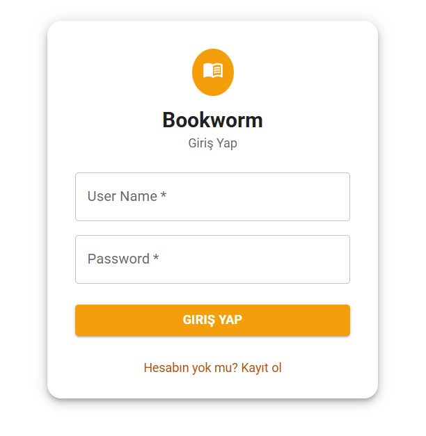

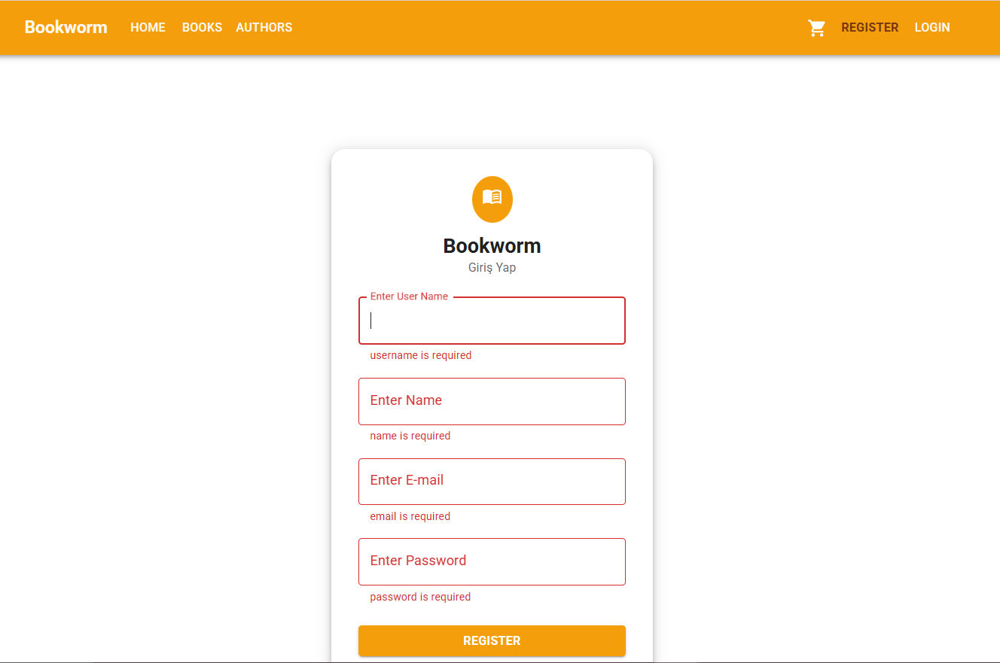

### 🛍️ Product Management
- Product listing
- Product detail pages

📸 Example:
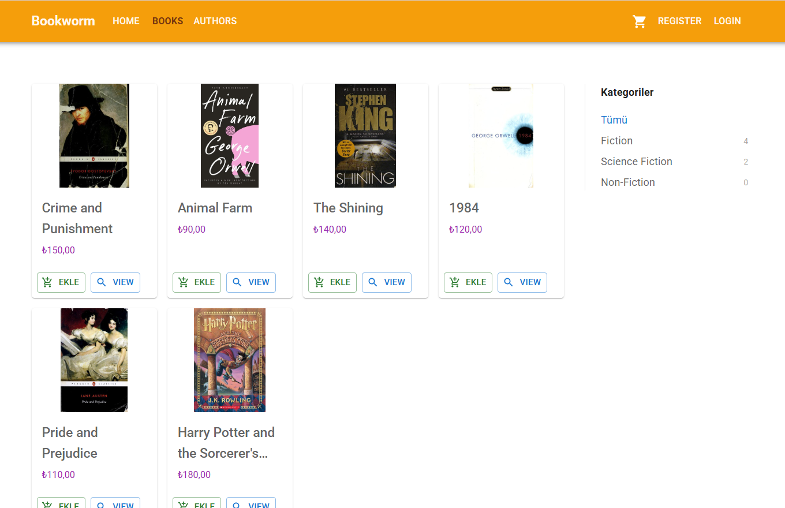

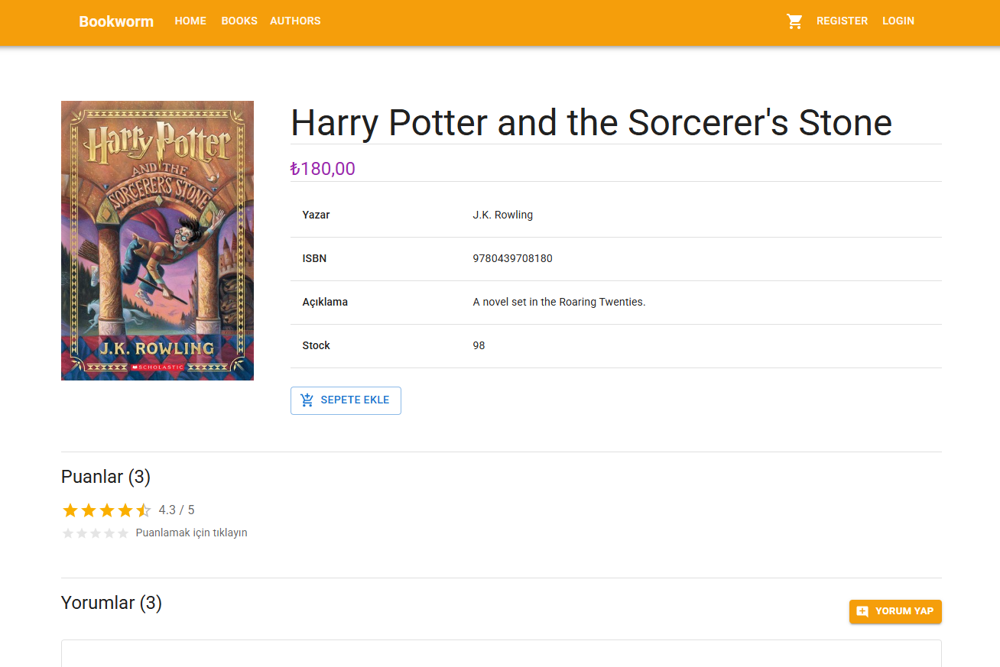

### 🛒 Cart & Orders
- Add / remove products from cart
- Cart synchronization
- Order creation
- Order history

📸 Example:
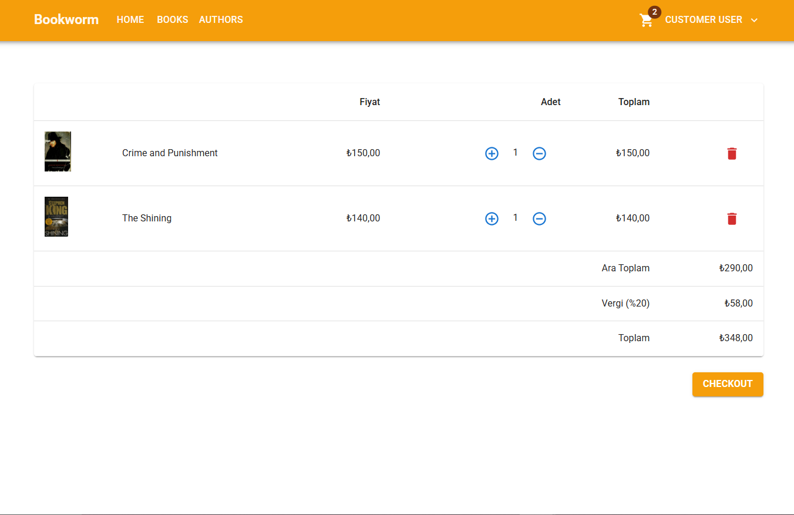

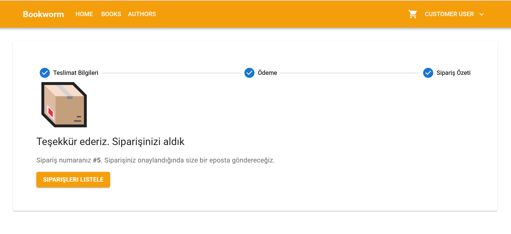

### 📧 Email Notifications
Automated email notifications are sent to customers via **Hangfire background jobs**:

- ✅ **Order Confirmation** – Sent immediately after a successful order is placed
- 🔄 **Order Status Updates** – Sent whenever an admin updates the order status:
  - Onaylandı ✅
  - Kargoya Verildi 🚚 (includes tracking number)
  - Tamamlandı 🎉
  - İptal Edildi ❌

 

Emails are processed **asynchronously in the background** — the API response is not blocked by the email sending process. Failed jobs are automatically retried up to 10 times.

### ⚙️ Hangfire Dashboard
The Hangfire dashboard is available at `/hangfire` and provides:
- Real-time job monitoring
- Succeeded / failed / retrying job history
- Manual job triggering

### ⭐ Rating Features
- Users can rate books from 1 to 5 stars
- Real-time average rating calculation
- Inline rating submission (no page reload)
- Users can:
  - Update their rating
  - Delete their rating
    
### 💭 Comment Features
- Add comments to books
- Edit existing comments
- Delete comments with confirmation dialog
- Display:
  - Username / Full name
  - Comment content
  - Creation date
- Integrated with rating system:
  - User's rating is displayed alongside their comment

📸 Example:
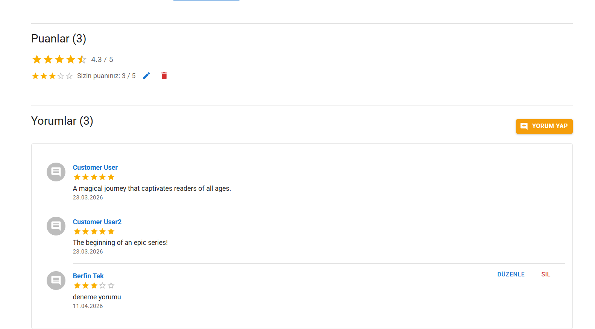

### 💳 Payment Integration
#### 🏦 iyzico Payment System
- Integrated with iyzico payment gateway
- Secure online payment processing
- Supports:
  - Credit card payments
- Backend-driven payment flow
- Order is created only after successful payment confirmation

📸 Example:
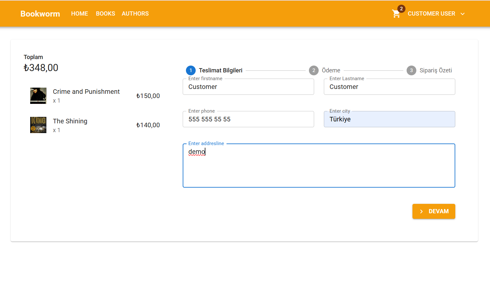

#### 🔐 Payment Security
- Sensitive data is securely handled via iyzico API
- No card information is stored on the server
- Payment requests are verified on backend

📸 Example:
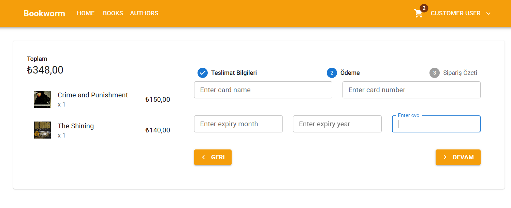

## 🧑‍💼 Admin Dashboard (Advanced)

The application includes a fully functional **Admin Panel** that enables complete control over products, orders, and system analytics.

### 📊 Dashboard Overview
The admin dashboard provides real-time insights into the system:
- Total number of orders
- Daily order count
- Total users
- Pending orders
- Total revenue
- Monthly sales statistics (chart-based)

📸 Example:
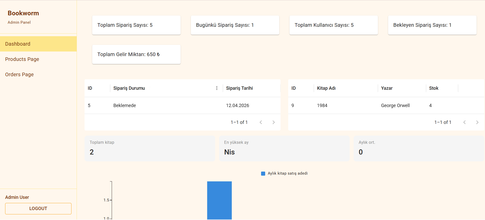

### 📦 Product Management
Admins can manage all products through a table-based interface:
- View all products
- Update product details
- Delete products
- Manage stock levels

Displayed data includes:
- Product ID
- Book name
- Author
- Stock quantity

📸 Example:
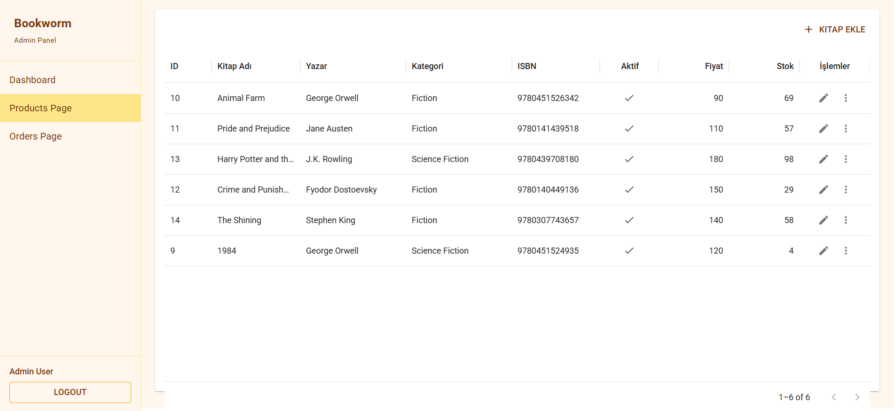

### 🧾 Order Management
Admins can monitor and manage all customer orders:
- View all orders in a table
- Access detailed order information
- Track:
  - Customer details
  - Order date
  - Total price
  - City & contact info

📸 Example:
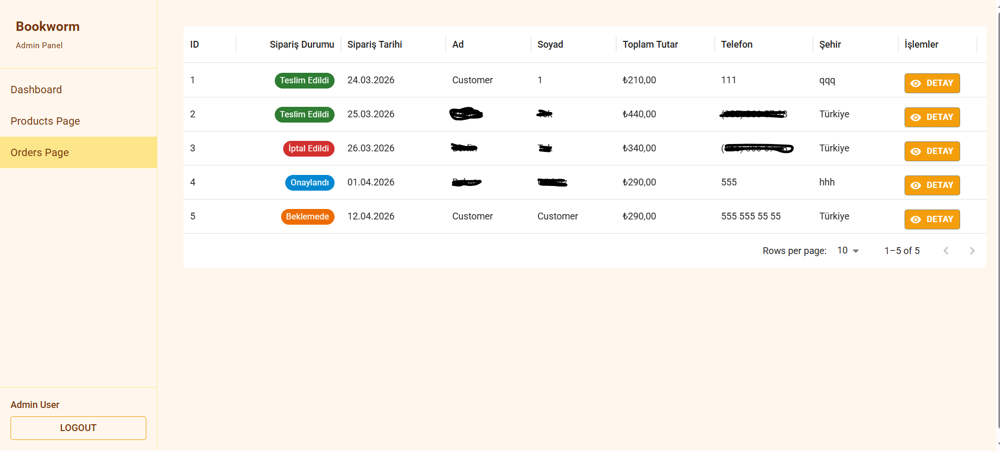

### 🔍 Order Detail & Status Update
Each order includes a detailed modal view:
- Customer information:
  - Name
  - Phone
  - Address
- Ordered items:
  - Product name
  - Quantity
  - Price
- Total order amount

Admins can update order status dynamically:
- Pending (Beklemede)
- Approved (Onaylandı)
- Shipped (Kargoya Verildi)
- Delivered (Teslim Edildi)
- Cancelled (İptal Edildi)
- Payment Failed (Ödeme Başarısız)

> 📧 An automated email is sent to the customer on every status change.

📸 Example:
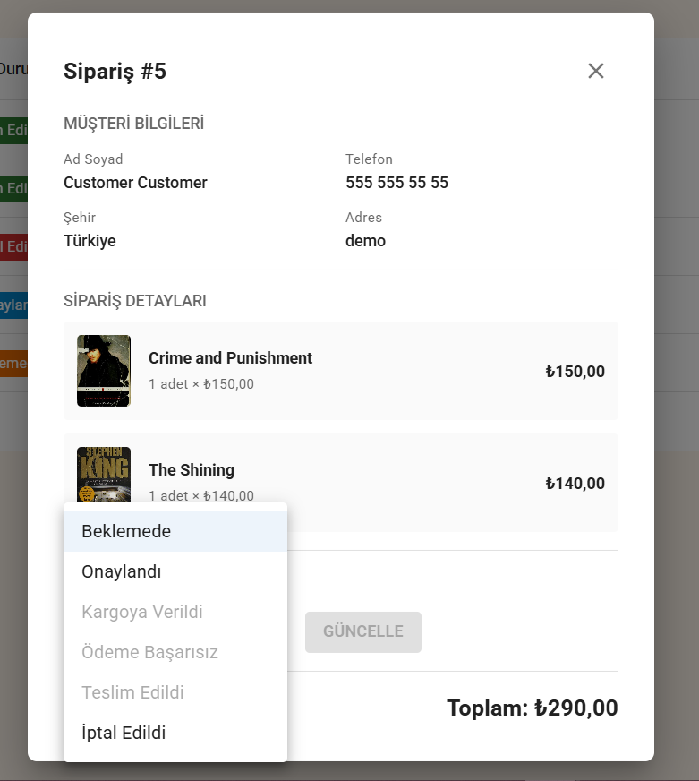

---

## 🏗️ Proje Mimarisi

### Backend Yapısı
```txt
API
 ├── Controllers
 ├── Dtos
 ├── Entity
 ├── Data (DbContext)
 ├── Services
 │   ├── TokenService
 │   └── EmailService (Hangfire + MailKit)
 └── Extensions
```

### 🏗️ Frontend Structure
```txt
src
 ├── api
 ├── assets
 ├── components
 │   └── layout
 ├── context
 ├── features
 ├── model
 ├── router
 ├── store
 └── utils
```

## ⚙️ Setup & Installation

### Prerequisites
- .NET SDK 9.0 or higher
- npm and yarn

---

### Installation Steps

#### 1. Clone the Repository
```sh
git clone https://github.com/berfin-t/Book-Worm.git
cd Bookworm
```

#### 2. Configure Email Settings
Add the following to `appsettings.json`:
```json
"Email": {
  "SmtpHost": "smtp.gmail.com",
  "SmtpPort": "587",
  "From": "your-email@gmail.com",
  "Username": "your-email@gmail.com",
  "Password": "your-app-password"
}
```
> ⚠️ Use a **Gmail App Password**, not your regular Gmail password. Enable 2FA on your Google account first, then generate an App Password at https://myaccount.google.com/apppasswords

#### 3. For backend
```sh
cd Bookworm.API
dotnet run
```

#### 4. For frontend
```sh
cd Bookworm.Client
npm run dev
```

#### 🌐 Access the Application
Once the services are running, open your browser and navigate to:
- **App:** http://localhost:5173/
- **Hangfire Dashboard:** http://localhost:5000/hangfire

---

## 🔐 Default User Credentials

The application comes with predefined users for testing and development purposes.

### 👑 Admin User
- **Username:** admin
- **Password:** Admin_1

---

### 👤 Employee User
- **Username:** customer
- **Password:** Customer_1

> ⚠️ **Security Notice:**  
> These credentials are intended for **development and testing only**.  
> Make sure to change default passwords before deploying to a production environment.

---

## 📄 License

This project is licensed under the **MIT License**.  
See the `LICENSE` file for details.

---

## 👩‍💻 Author

**Berfin Tek**  
GitHub: https://github.com/berfin-t
